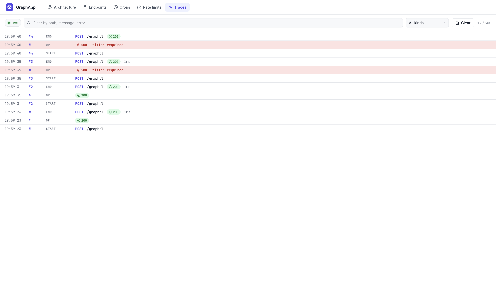

# nexus

A Go framework over [Gin](https://github.com/gin-gonic/gin) that lets you write plain handler functions, wires them into REST + GraphQL + WebSocket transports, and ships a live Vue dashboard that renders your service topology, per-endpoint traffic, rate limits, errors, and cron jobs as they happen.


```go
func main() {
    nexus.Run(
        nexus.Config{Addr: ":8080", EnableDashboard: true},
        nexus.ProvideResources(NewMainDB, NewCacheManager),
        auth.Module(auth.Config{Resolve: resolveBearer}),
        advertsModule,
        nexus.AsWorker("cache-invalidation", NewCacheInvalidationWorker),
    )
}

var advertsModule = nexus.Module("adverts",
    nexus.ProvideService(NewAdvertsService),
    nexus.AsQuery(NewGetAllAdverts),
    nexus.AsMutation(NewCreateAdvert,
        auth.Required(),
        auth.Requires("ROLE_CREATE_ADVERT"),
        nexus.Use(ratelimit.NewMiddleware(store, "adverts.createAdvert",
            ratelimit.Limit{RPM: 30, Burst: 5})),
    ),
)
```

No fx import. No schema assembly. No middleware plumbing. The handler is plain Go, the dashboard is at `/__nexus/`.

## Highlights

- **Reflective controllers** — write `func(svc, deps..., args) (*T, error)`; nexus's `AsRest` / `AsQuery` / `AsMutation` introspect the signature and wire the transport. No `graph.NewResolver[T](...).With...` boilerplate.
- **Module-first architecture view** — `nexus.Module("name", opts...)` groups endpoints as one card on the dashboard; services appear as typed *dependency nodes* that both handlers and service constructors can point at. `nexus.ProvideService` inspects the constructor's params and draws service → resource / service → service edges automatically.
- **Built-in auth** — `auth.Module` ships a pluggable authentication surface (bearer / cookie / api-key extraction, cached identity resolution, per-op `auth.Required` / `auth.Requires(perms)` bundles, admin invalidation + live `auth.reject` trace events on the dashboard's Auth tab).
- **Background workers** — `nexus.AsWorker` wraps long-lived listeners (DB LISTEN/NOTIFY, queue consumers, sweepers) with framework-owned lifecycle, ctx cancellation, panic recovery, and a card on the architecture view that shows their dep graph.
- **One middleware API for three transports** — `middleware.Middleware` bundles a `gin.HandlerFunc` + `graph.FieldMiddleware` from a single definition; `nexus.Use(mw)` attaches it to any kind of endpoint.
- **Live dashboard** — Architecture, Endpoints, Crons, Rate limits, Auth, Traces tabs. Traffic animations pulse on real requests — inbound lanes, per-op resource edges, and service-level edges all light up in sync. Error dialog shows recent errors with IP + timestamp (scales to 1000 events via virtualized scrolling).
- **Per-op observability, free** — every handler gets a request + error counter and streams a `request.op` event, all without any user code.
- **Layered rate limiting** — global (engine-root gin middleware) + per-op (graph field middleware), hot-swappable from the dashboard at runtime.
- **Cross-transport cron jobs** — schedule bare handlers; control (pause/resume/trigger-now) lives on the dashboard.
- **fx under the hood, not in your imports** — `nexus.Run/Module/Provide/Invoke` wrap fx so you get DI + lifecycle without importing `go.uber.org/fx`.

## Install

```bash
go get github.com/paulmanoni/nexus
go install github.com/paulmanoni/nexus/cmd/nexus@latest   # optional CLI
```

Requires Go 1.25+.

## CLI

The `nexus` binary is a thin convenience wrapper — everything it does is
reachable through plain `go` commands, but having one entry-point for the
common-case loop keeps muscle memory short.

```bash
nexus new my-app          # scaffold main.go + module.go + go.mod + .gitignore
cd my-app
go mod tidy
nexus dev                 # go run . + auto-open http://localhost:8080/__nexus/
```

| Command | What it does |
|---|---|
| `nexus new <dir>` | Creates a minimal app (reflective `AsRest` + dashboard). `-module <path>` overrides the go.mod path. |
| `nexus dev [dir]` | Runs `go run <dir>` (default `.`), probes `:8080`, opens the dashboard as soon as it responds. `-addr host:port` to change the probe target, `-no-open` to skip the browser. |
| `nexus version` | Prints the CLI version. |

## Quick start

```go
package main

import (
    "context"

    "github.com/paulmanoni/nexus"
)

// Service wrapper — distinct Go type per logical service so fx can
// route by type (no named tags).
type AdvertsService struct{ *nexus.Service }

func NewAdvertsService(app *nexus.App) *AdvertsService {
    return &AdvertsService{app.Service("adverts").Describe("Job adverts catalog")}
}

// Typed DB handle — same pattern. Fx resolves by type, compile-time
// routing, no string lookups.
type MainDB struct{ *DB }

func NewMainDB() *MainDB { /* Open, migrate, return wrapper */ }

// Every dep the handler declares shows up on the dashboard:
//   - *AdvertsService  →  grounds the op under the "adverts" service
//   - *MainDB          →  draws an edge from adverts → main resource
//   - nexus.Params[T]  →  resolve context + typed args bundle
func NewListAdverts(svc *AdvertsService, db *MainDB, p nexus.Params[struct{}]) (*Response, error) {
    return fetch(p.Context, db)
}

func main() {
    nexus.Run(
        nexus.Config{
            Addr:            ":8080",
            DashboardName:   "Adverts",
            TraceCapacity:   1000,
            EnableDashboard: true,
        },
        nexus.ProvideResources(NewMainDB),
        nexus.Module("adverts",
            nexus.Provide(NewAdvertsService),
            nexus.AsQuery(NewListAdverts),
        ),
    )
}
```

Open <http://localhost:8080/__nexus/>. Fire a request → packet animation on the Architecture tab.

## Core concepts

### App and Config

`nexus.Run(cfg, opts...)` builds and runs the app. Block until SIGINT/SIGTERM, then gracefully shuts down. `Config` covers environment-level knobs; options are the building blocks of your graph.

```go
nexus.Run(nexus.Config{
    Addr:            ":8080",
    DashboardName:   "Adverts",
    TraceCapacity:   1000,
    EnableDashboard: true,

    // GraphQL toggles — one switch, all services
    DisablePlayground: false,
    GraphQLDebug:      false,

    // App-wide rate limit (applies to every HTTP path)
    GlobalRateLimit: ratelimit.Limit{RPM: 600, Burst: 50},
})
```

Option builders:

| Option | Produces |
|---|---|
| `nexus.Module(name, opts...)` | Named group of options. Stamps module name onto every endpoint for the architecture view. |
| `nexus.Provide(fns...)` | Constructor(s) into the dep graph. |
| `nexus.ProvideService(fn)` | Provide + introspect: detects resource / service deps from the constructor's params and records them for the Architecture view. |
| `nexus.ProvideResources(fns...)` | Like Provide, but auto-registers resources via `NexusResourceProvider`. |
| `nexus.Supply(vals...)` | Ready-made values into the dep graph. |
| `nexus.Invoke(fn)` | Side-effect at start-up; receives deps via function params. |
| `nexus.AsRest(method, path, fn, opts...)` | REST endpoint from a reflective handler. |
| `nexus.AsQuery(fn, opts...)` / `AsMutation(fn, opts...)` | GraphQL op, auto-mounted by the framework. |
| `nexus.AsWS(path, type, fn, opts...)` | WebSocket endpoint scoped to one envelope message type; multiple AsWS on the same path share one hub. |
| `nexus.AsWorker(name, fn)` | Long-lived background task; framework manages lifecycle + records status. |
| `nexus.Use(middleware.Middleware)` | Cross-transport middleware — works on REST + GraphQL. |
| `auth.Module(auth.Config{Resolve: ...})` | Built-in auth surface: extraction + cached resolution + per-op enforcement bundles. |

### Reflective handlers

Write handlers as plain Go functions. Signature convention:

```go
func NewOp(svc *XService, deps..., p nexus.Params[ArgsStruct]) (*Response, error)
```

- **First `*Service`-wrapper dep** grounds the op under that service. Auto-routing picks the single-service default when omitted.
- **`context.Context`** anywhere in the deps list is special-cased (filled from `p.Context`).
- **Last param** (if it's a struct, or `nexus.Params[T]`) carries user-supplied args.
- **Return** must be `(T, error)` — T becomes the GraphQL return type, flow-through for REST.

```go
type CreateArgs struct {
    Title        string `graphql:"title,required" validate:"required,len=3|120"`
    EmployerName string `graphql:"employerName,required" validate:"required,len=2|200"`
}

func NewCreateAdvert(svc *AdvertsService, db *MainDB,
                     p nexus.Params[CreateArgs]) (*AdvertResponse, error) {
    return create(p.Context, db, p.Args.Title, p.Args.EmployerName)
}
```

Tags drive the schema + validators:
- `graphql:"name,required"` — field name + NonNull marker
- `validate:"required,len=3|120"` — `graph.Required()` + `graph.StringLength(3, 120)`, introspected by the dashboard as chips

### Service + typed resource wrappers

Resources (DBs, caches, queues) are typed wrappers that own their dashboard metadata. No resourcesModule, no string matching.

```go
type MainDB struct{ *DB }

func (m *MainDB) NexusResources() []resource.Resource {
    return []resource.Resource{
        resource.NewDatabase("main", "GORM — sqlite",
            map[string]any{"engine": "sqlite", "schema": "main"},
            m.IsConnected, resource.AsDefault()),
    }
}
```

Any handler that takes `*MainDB` as a dep auto-draws the `service → main` edge on the Architecture graph — no `Using(...)` call required.

### Cross-transport middleware

```go
// Build once — bundle carries Gin + Graph realizations.
authMw := middleware.Middleware{
    Name:        "auth",
    Description: "Bearer token validation",
    Kind:        middleware.KindBuiltin,
    Gin:         authGinHandler,
    Graph:       authResolverMiddleware,
}

// Apply anywhere.
nexus.AsRest("POST", "/secure", NewSecureHandler, nexus.Use(authMw))
nexus.AsMutation(NewMutate,                    nexus.Use(authMw))

// Global — every HTTP path (REST + GraphQL + WS upgrade + dashboard)
nexus.Config{
    GlobalMiddleware: []middleware.Middleware{requestID, logger, cors},
}
```

Built-ins that ship:
- `ratelimit.NewMiddleware(store, key, limit)` — token-bucket with per-IP option
- `metrics` — auto-attached to every op, no user code

### Rate limits

Layered by default:

| Layer | How | Where |
|---|---|---|
| **Global** | `Config.GlobalRateLimit` | gin middleware on engine root |
| **Per-op** | `nexus.Use(ratelimit.NewMiddleware(...))` | per-handler |
| **Runtime override** | Rate limits tab in dashboard | hot-swappable without redeploy |

Store swap for multi-replica:
```go
nexus.Config{
    RateLimitStore: ratelimit.NewRedisStore(redisClient), // not yet shipped
    // or just
    Cache: cache.NewManager(cfg, logger), // app auto-uses this for the store
}
```

### Metrics + error dialog

Every op automatically gets:
- Request counter (atomic, ~70 ns)
- Error counter
- Ring of recent error events (IP, timestamp, message) capped at 1000
- `request.op` trace event emitted on every handler exit

The Architecture tab shows `⚡N` (request count) and `⚠N` (errors) chips per op. Click the error chip → paginated dialog with filter over IP/message + virtualized scrolling that stays snappy at thousands of events.

### Auth (built-in)

`auth.Module` owns the plumbing — token extraction, identity caching, per-op enforcement, context propagation — and leaves *resolution* (token → Identity) as the single plug you wire:

```go
import "github.com/paulmanoni/nexus/auth"

nexus.Run(nexus.Config{...},
    auth.Module(auth.Config{
        // Required: turn a raw token into an Identity.
        Resolve: func(ctx context.Context, tok string) (*auth.Identity, error) {
            u, err := myAPI.ValidateToken(ctx, tok)
            if err != nil { return nil, err }
            return &auth.Identity{
                ID:    u.ID,
                Roles: u.Roles,
                Extra: u,   // user-defined payload, typed-accessible later
            }, nil
        },
        Cache: auth.CacheFor(15 * time.Minute),

        // Optional: match your existing error envelope
        OnUnauthenticated: func(c *gin.Context, err error) {
            c.AbortWithStatusJSON(401, pkg.Response[any]{Success: false, Message: "UnAuthorized"})
        },
    }),
    advertsModule,
)
```

Per-op gating (cross-transport):

```go
nexus.AsMutation(NewCreateAdvert,
    auth.Required(),                         // 401 if no identity
    auth.Requires("ROLE_CREATE_ADVERT"),     // 403 if missing permission
)
```

Resolver access:

```go
func NewListAdverts(db *MainDB, p nexus.Params[struct{}]) (*Response, error) {
    user, ok := auth.User[MyUser](p.Context)
    if !ok {
        // Required() would have caught this earlier, but a direct
        // check is idiomatic for handlers using auth.Optional().
    }
    return fetch(p.Context, db, user.ID)
}
```

Token extraction strategies ship ready-made — `auth.Bearer()`, `auth.Cookie(name)`, `auth.APIKey(header)`, `auth.Chain(...)` — plus the typed `auth.User[T]` generic accessor, `auth.AnyOf`/`auth.AllOf` permission helpers, and a `*auth.Manager` handle (fx-injected) for logout flows:

```go
func NewLogoutHandler(am *auth.Manager) func(context.Context, nexus.Params[TokenArgs]) (OK, error) {
    return func(ctx context.Context, p nexus.Params[TokenArgs]) (OK, error) {
        am.Invalidate(p.Args.Token)         // single-session logout
        // or am.InvalidateByIdentity(userID) → sweeps every cached session for that user
        return OK{}, nil
    }
}
```

Dashboard's Auth tab renders the cached identity table, recent 401/403 rejections (live via `auth.reject` trace events), and per-row "invalidate" buttons — all driven off `GET /__nexus/auth` + `POST /__nexus/auth/invalidate`.

### Workers

`nexus.AsWorker` wraps long-lived background tasks (DB `LISTEN`/`NOTIFY` loops, queue consumers, sweepers) with framework-owned lifecycle:

```go
nexus.AsWorker("cache-invalidation",
    func(ctx context.Context, db *OatsDB, cache *CacheManager, logger *zap.Logger) error {
        // Wait for dependencies to come up
        for !db.IsConnected() {
            select {
            case <-ctx.Done(): return ctx.Err()
            case <-time.After(time.Second):
            }
        }

        listener := pq.NewListener(db.ConnectionString(), 10*time.Second, time.Minute, nil)
        defer listener.Close()
        if err := listener.Listen("cache_invalidation"); err != nil { return err }

        for {
            select {
            case <-ctx.Done():
                return nil                  // clean stop on fx.Stop
            case n := <-listener.Notify:
                handleInvalidation(ctx, cache, n)
            }
        }
    })
```

The framework starts the function on its own goroutine at `fx.Start`, cancels `ctx` at `fx.Stop`, recovers panics, and records `Status` / `LastError` on the registry. The worker appears as a dedicated card on the Architecture view with its dep graph (resources + services it took as params) drawn as outgoing edges — same visual language as services.

Signature requirements:
- First param MUST be `context.Context`.
- Remaining params are fx-injected deps (resources, services, loggers, whatever's in the graph).
- Optional `error` return sets `LastError` on the registry; `context.Canceled` / `nil` is a clean stop.

### Cron jobs

```go
app.Cron("refresh-cache", "*/5 * * * *").
    Describe("Refresh advert cache").
    Handler(func(ctx context.Context) error {
        return refreshCache(ctx)
    })
```

Dashboard Crons tab: schedule, last run, last result, pause/resume, trigger-now.

### WebSocket (AsWS)

`AsWS(path, messageType, fn)` registers a reflective WebSocket handler scoped
to one inbound envelope type. Multiple `AsWS` calls for the same path share
one connection pool — the framework dispatches by the envelope's `type` field.

```go
type ChatPayload struct {
    Text string `json:"text"`
}

func NewChatSend(svc *ChatService, sess *nexus.WSSession,
                 p nexus.Params[ChatPayload]) error {
    sess.EmitToRoom("chat.message",
        map[string]string{"text": p.Args.Text, "user": sess.UserID()},
        "lobby")
    return nil
}

var chat = nexus.Module("chat",
    nexus.Provide(NewChatService),
    nexus.AsWS("/events", "chat.send",   NewChatSend,   auth.Required()),
    nexus.AsWS("/events", "chat.typing", NewChatTyping),
)
```

**Wire protocol** — every message is wrapped in the envelope:

```json
{ "type": "chat.send", "data": { "text": "hello" }, "timestamp": 1700000000 }
```

The built-in types `ping`, `authenticate`, `subscribe`, `unsubscribe` are
handled by the framework hub and never reach user handlers. Custom types
dispatch to the matching `AsWS` registration; unknown types are dropped
silently.

**Session API** (`*nexus.WSSession`) mirrors the fan-out semantics of the
oats_applicant hub pattern:

| Call | Scope |
|---|---|
| `sess.Send(type, data)` | Unicast back to the originating connection. |
| `sess.Emit(type, data)` | Broadcast to every connection on this endpoint. |
| `sess.EmitToUser(type, data, userID...)` | Every connection authed as one of the listed users. |
| `sess.EmitToRoom(type, data, room)` | Every connection subscribed to the room. |
| `sess.EmitToClient(type, data, clientID...)` | Specific ClientIDs. |
| `sess.JoinRoom(room)` / `sess.LeaveRoom(room)` | Server-side room membership (client can also use the built-in `subscribe`/`unsubscribe` protocol messages). |
| `sess.ClientID()` / `sess.UserID()` / `sess.Metadata()` / `sess.Context()` | Connection-scoped accessors. |
| `sess.SendRaw(bytes)` | Escape hatch for non-envelope payloads. |

**Identity** at upgrade time: the framework picks `?userId=` from the URL
or an auth-middleware-set `user` value in `gin.Context` (anything satisfying
`interface{ GetID() string }`). Handlers read it via `sess.UserID()`;
`auth.Required()` and friends work as middleware on the upgrade route.

**Middleware rule** — `nexus.Use(mw)`, `auth.Required()`, etc. on the *first*
`AsWS` call for a path install on the HTTP upgrade route. Middleware on
later calls for the same path is ignored with a warning log (every dispatch
shares one upgrade route).

Handler errors come back as an `error` envelope on the same connection and
keep the socket open:

```json
{ "type": "error", "data": { "type": "chat.send", "message": "too long" }, "timestamp": ... }
```

For the full hub API (custom upgrader, typed event envelopes, connection
worker-pool sizing), the imperative builder is still available:
`(*Service).WebSocket(path).WithHub(hub).Mount()`.

### Cache

`cache.Manager` is go-cache in-memory by default; switches to Redis when env is configured. Always present on `App` — nexus uses it for metrics persistence automatically.

```go
mgr := app.Cache()
_ = mgr.Set(ctx, "k", value, 5*time.Minute)
```

### Deployment-ready modules (preview)

`nexus.DeployAs(tag)` marks a module as a candidate deployment unit — the
seam a future split would peel off. In monolith mode (the default,
unchanged) the tag is metadata only: every endpoint registered under the
module gets a `Deployment` field on the registry, surfaced on
`/__nexus/endpoints` so the dashboard can render the planned topology
before any splitting actually happens.

```go
var users = nexus.Module("users",
    nexus.DeployAs("users-svc"),
    nexus.Provide(NewUsersService),
    nexus.AsRest("GET", "/users/:id", NewGetUser),
)

func main() {
    nexus.Run(nexus.Config{
        Addr:       ":8080",
        Deployment: nexus.DeploymentFromEnv(), // reads NEXUS_DEPLOYMENT
        Version:    version,                    // -ldflags-stamped
    }, users, billing, checkout)
}
```

`Config.Deployment` and `Config.Version` are surfaced on `/__nexus/config`.
The version is what cross-service generated clients will check on first
call to detect peer-version skew (a major source of "weird microservice
bugs"). `DeploymentFromEnv()` reads `NEXUS_DEPLOYMENT` so a single
compiled binary boots as different units in different environments
without rebuilding.

The deployable-module direction is the same as
[Service Weaver](https://github.com/ServiceWeaver/weaver) — write a
monolith, deploy as N services with a single command. The lessons from
Weaver's archival shape what nexus is *not* doing: no `Implements[T]`
mixin, no rewrite tax, untagged modules stay exactly as they are today.

**Currently shipping** (v0.9): `DeployAs` annotation, Config.Deployment +
Version, dashboard surfaces.
**Coming next**: codegen'd cross-module clients (`nexus gen clients`), a
`nexus dev --split` runner that boots each tagged module as a localhost
subprocess for testing the distributed semantics, peer-version skew
warnings on first call.

## Dashboard

Mounted at `/__nexus/` when `EnableDashboard: true`. Six tabs:

| Tab | What it shows |
|---|---|
| **Architecture** | Module containers + endpoints, service-dep nodes, worker cards, resource nodes, external "Clients" node, dashed system boundary. Per-op and service-level edges both pulse on live traffic (green for success, red ✕ for rejections). |
| **Endpoints** | REST path and GraphQL op-name list; per-endpoint tester (curl + Playground for GraphQL), arg validators rendered as chips. |
| **Crons** | Schedule table, pause/resume, trigger-now. |
| **Rate limits** | Declared vs effective limit per endpoint, inline edit (RPM/burst/perIP) with save/reset. |
| **Auth** | Cached identities (redacted tokens), live 401/403 stream, per-identity invalidation. Renders a "not configured" prompt when `auth.Module` isn't wired. |
| **Traces** | WebSocket stream of request events, filterable. |

Tab selection persists via `?tab=` in the URL — shareable, bookmarkable, survives refresh.



### Gating the dashboard

Opt the whole `/__nexus/*` surface (JSON APIs, WebSocket events, embedded UI) into your own auth / permission chain by passing middleware bundles:

```go
nexus.Run(
    nexus.Config{
        EnableDashboard: true,
        DashboardMiddleware: []middleware.Middleware{
            {Name: "auth",  Kind: middleware.KindBuiltin, Gin: bearerAuthGin},
            {Name: "admin", Kind: middleware.KindCustom,  Gin: requireAdminGin},
        },
    },
    // ...
)
```

Middleware runs on the `/__nexus` route group before any dashboard handler, so one chain covers every dashboard request. Bundles with a nil `Gin` realization are ignored (the dashboard is HTTP-only). `nexus.WithDashboardMiddleware(...)` is the equivalent `AppOption` for callers using `nexus.New`.

HTTP surface:

| Route | Returns |
|---|---|
| `GET  /__nexus/` | Embedded Vue UI |
| `GET  /__nexus/endpoints` | Services + endpoints (services carry `ResourceDeps` / `ServiceDeps` from `ProvideService`) |
| `GET  /__nexus/resources` | Resource snapshots (health probed live) |
| `GET  /__nexus/workers` | `AsWorker` registrations + live Status / LastError / deps |
| `GET  /__nexus/middlewares` | `{ middlewares: [...], global: [ordered names] }` |
| `GET  /__nexus/stats` | Per-endpoint counters (RecentErrors stripped) |
| `GET  /__nexus/stats/:service/:op/errors` | Full error ring for one endpoint |
| `GET  /__nexus/ratelimits` | Store snapshot |
| `POST /__nexus/ratelimits/:service/:op` | Override a limit |
| `DELETE /__nexus/ratelimits/:service/:op` | Reset to declared |
| `GET  /__nexus/crons`, `POST /.../:name/{trigger,pause,resume}` | Cron control |
| `GET  /__nexus/auth` | `{ identities, cachingEnabled }` — cached auth state |
| `POST /__nexus/auth/invalidate` | Body `{id?|token?}` → drops cache entries (`{dropped: N}`) |
| `GET  /__nexus/events` | WebSocket: trace + `request.op` + `auth.reject` events |

### Developing the UI

```bash
cd dashboard/ui
npm install
npm run dev       # Vite dev server
npm run build     # dist/ gets embedded into Go binaries via //go:embed
```

## Benchmarks

Microbenchmarks of the per-request hot paths on an Apple M1 Pro:

| Path | ns/op | allocs |
|---|---:|---:|
| `metrics.Record` (success, single key) | 73 | 0 |
| `metrics.Record` (parallel, 10 cores) | 238 | 0 |
| `ratelimit.Allow` (single key) | 134 | 1 |
| `callHandler` (reflective invoke) | 477 | 5 |
| `bindGqlArgs` (map → struct) | 250 | 4 |
| direct function call (baseline) | 0.3 | 0 |

A request going through `AsQuery` with args, metrics, and one rate limit therefore pays on the order of 73 + 134 + 477 + 250 ≈ **1 μs** of nexus-side work. The surrounding cost (Gin routing, graphql-go query parsing, JSON encoding, your handler, any DB/cache roundtrip) is measured by your own load test, not by this README.

Run the microbenchmarks:
```bash
go test ./metrics ./ratelimit ./ -bench=. -benchmem -run 'x^'
```

For end-to-end numbers on your own workload, load-test a real endpoint:
```bash
vegeta attack -rate=10000 -duration=30s -targets=targets.txt | vegeta report
```

## Examples

| Path | Shows |
|---|---|
| `examples/petstore` | Minimal REST + WebSocket + tracing. |
| `examples/fxapp` | Multi-domain app wired via `nexus.Module` (fx hidden). |
| `examples/graphapp` | GraphQL via reflective AsQuery/AsMutation, typed DB wrappers, rate limits, validators, metrics. |
| `examples/wstest` | WebSocket echo playground (imperative `(*Service).WebSocket(...)` path). |
| `examples/wsecho` | Typed WebSocket via `AsWS` — two message types on one path, envelope protocol, session fan-out. |

Run any example:
```bash
go run ./examples/graphapp
```

## Package layout

```
nexus/                top-level App, Run, Module, Provide, ProvideService, AsWorker, Use, Cron, options
├── auth/             built-in authentication surface (extractors, identity cache, per-op bundles, dashboard routes)
├── graph/            absorbed go-graph resolver builder + validators
├── registry/         services, endpoints, resources, workers, middleware metadata
├── resource/         Database/Cache/Queue abstractions + health probing
├── trace/            ring-buffer bus + per-request middleware + op events
├── transport/
│   ├── rest/         REST builder
│   ├── gql/          GraphQL HTTP adapter (Playground, auth hook)
│   └── ws/           WebSocket builder + Hub
├── middleware/       Info + cross-transport Middleware bundle
├── metrics/          per-endpoint counters, error ring, cache-backed store
├── ratelimit/        token-bucket store, Gin + Graph middleware factories
├── cron/             scheduler, dashboard HTTP, event emission
├── cache/            Redis + in-memory hybrid (nexus uses it as a default)
├── multi/            N named instances behind .Using(name) (legacy pattern)
├── db/               opinionated GORM helpers (Manager.DB(ctx), ConnectionString, GetCtx)
├── dashboard/        /__nexus HTTP surface + embedded Vue UI
└── examples/         runnable demos
```

## Testing

```bash
go build ./...
go vet ./...
go test ./...
go test ./... -bench=. -benchmem -run 'x^'
```

## License

[MIT](LICENSE)
