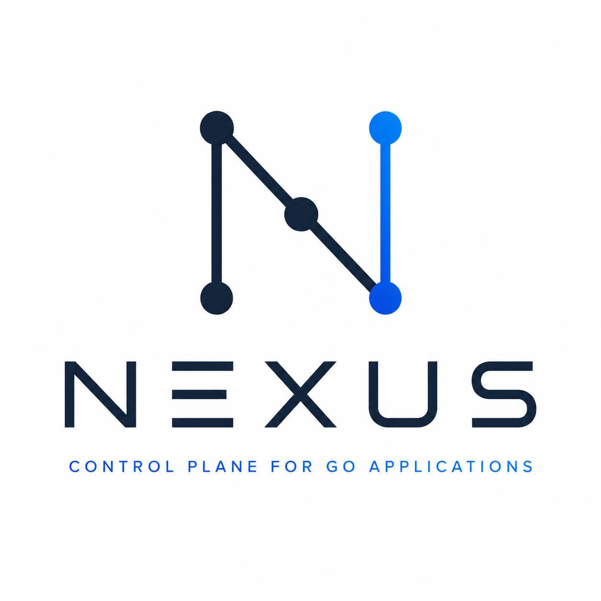
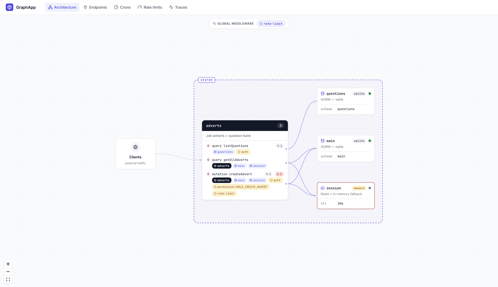

<p align="center">
  
</p>

# nexus

A Go framework over [Gin](https://github.com/gin-gonic/gin) that lets you write plain handlers, wires them into REST + GraphQL + WebSocket from one signature, and ships a live dashboard at `/__nexus/`.



```go
func main() {
    nexus.Run(
        nexus.Config{
            Server:    nexus.ServerConfig{Addr: ":8080"},
            Dashboard: nexus.DashboardConfig{Enabled: true, Name: "Adverts"},
        },
        nexus.ProvideResources(NewMainDB),
        adverts.Module,
    )
}

var Module = nexus.Module("adverts",
    nexus.Provide(NewService),
    nexus.AsQuery(NewListAdverts),
    nexus.AsMutation(NewCreateAdvert,
        auth.Required(),
        auth.Requires("ROLE_CREATE_ADVERT"),
    ),
)
```

No fx import. No schema assembly. No middleware plumbing. The handler is plain Go, the dashboard is at `/__nexus/`.

## Why nexus

- **One handler, three transports.** `AsRest` / `AsQuery` / `AsMutation` / `AsWS` all read the same reflective signature — `func(svc, deps..., p nexus.Params[Args]) (T, error)` — and wire the right transport.
- **Live architecture view.** `nexus.Module` groups endpoints; `ProvideService` introspects constructor params and draws service → service / service → resource edges automatically. Real traffic pulses on the edges.
- **Built-in auth, rate limits, metrics, traces.** Cross-transport bundles via `nexus.Use`. Per-op observability is free — every handler gets request/error counters and a trace event with no user code.
- **Manifest-driven deployment.** Write the app as a monolith, declare a few split units in `nexus.deploy.yaml`, ship N independent binaries from the same source. `go build -overlay` swaps cross-module `*Service` bodies for HTTP stubs at compile time — your code never branches on deployment.
- **fx under the hood, not in your imports.** `nexus.Run/Module/Provide/Invoke` wrap fx so you get DI + lifecycle without the import.

## Install

```bash
go get github.com/paulmanoni/nexus
go install github.com/paulmanoni/nexus/cmd/nexus@latest   # CLI
```

Requires Go 1.25+.

## CLI

```bash
nexus new my-app          # scaffold main.go + module.go + go.mod + nexus.deploy.yaml
cd my-app && go mod tidy
nexus dev                 # go run + auto-open the dashboard
```

| Command | Description |
|---|---|
| `nexus new <dir>` | Scaffold a minimal app with a heavily-commented manifest. |
| `nexus init [dir]` | Add `nexus.deploy.yaml` to an existing project (scans `DeployAs` tags). |
| `nexus dev [dir]` | `go run`, probe the port, open the dashboard. `--split` boots one subprocess per deployment unit and streams cross-service traces. |
| `nexus build --deployment <name>` | Build one deployment binary using `go build -overlay` (HTTP-stub shadows for non-owned modules + manifest-baked port/peers). |

## Quick start

```go
package main

import (
    "context"

    "github.com/paulmanoni/nexus"
)

// Service wrapper — distinct Go type per logical service so fx can
// route by type without named tags.
type AdvertsService struct{ *nexus.Service }

func NewAdvertsService(app *nexus.App) *AdvertsService {
    return &AdvertsService{app.Service("adverts").Describe("Job adverts catalog")}
}

// Typed DB handle — same pattern; fx resolves by type.
type MainDB struct{ *DB }

func NewMainDB() *MainDB { /* open, migrate, return wrapper */ }

// Every dep shows up on the dashboard:
//   *AdvertsService → grounds the op under "adverts"
//   *MainDB         → draws an edge from adverts → main
//   nexus.Params[T] → resolve context + typed args bundle
func NewListAdverts(svc *AdvertsService, db *MainDB, p nexus.Params[struct{}]) (*Response, error) {
    return fetch(p.Context, db)
}

func main() {
    nexus.Run(
        nexus.Config{
            Server:    nexus.ServerConfig{Addr: ":8080"},
            Dashboard: nexus.DashboardConfig{Enabled: true, Name: "Adverts"},
        },
        nexus.ProvideResources(NewMainDB),
        nexus.Module("adverts",
            nexus.Provide(NewAdvertsService),
            nexus.AsQuery(NewListAdverts),
        ),
    )
}
```

Open <http://localhost:9080/__nexus/> (admin port = `Addr` + 1000). Fire a request → packet animation on the Architecture tab.

## Reflective handlers

```go
func NewOp(svc *XService, deps..., p nexus.Params[Args]) (*Response, error)
```

- First `*Service`-wrapper dep grounds the op under that service. Single-service apps may omit it; multi-service apps either supply it or pin with `nexus.OnService[*Svc]()`. Service-less handlers (e.g. a public `HelloWorld`) mount on a synthesized default service partition.
- Last param (`nexus.Params[T]` or a trailing struct) carries args. `Params[T]` exposes `Context` + `Args`.
- Return must be `(T, error)`; `T` becomes the GraphQL return type.

```go
type CreateArgs struct {
    Title        string `graphql:"title,required"        validate:"required,len=3|120"`
    EmployerName string `graphql:"employerName,required" validate:"required,len=2|200"`
}

func NewCreateAdvert(svc *AdvertsService, db *MainDB, p nexus.Params[CreateArgs]) (*AdvertResponse, error) {
    return create(p.Context, db, p.Args.Title, p.Args.EmployerName)
}
```

`graphql:` builds the schema; `validate:` builds validators that the dashboard renders as chips.

## Options

| Option | Produces |
|---|---|
| `Module(name, opts...)` | Named group; stamps module name on every endpoint. |
| `Provide(fns...)` | Constructor(s) into the dep graph. |
| `ProvideService(fn)` | Provide + introspect: detects deps and draws Architecture edges. |
| `ProvideResources(fns...)` | Provide + auto-register resources via `NexusResourceProvider`. |
| `Supply(vals...)` | Ready-made values into the dep graph. |
| `Invoke(fn)` | Side-effect at start-up. |
| `AsRest(method, path, fn, opts...)` | REST endpoint. |
| `AsQuery(fn, opts...)` / `AsMutation(...)` | GraphQL op, auto-mounted. |
| `AsWS(path, type, fn, opts...)` | WebSocket scoped to one envelope type. |
| `AsWorker(name, fn)` | Long-lived background task; framework-managed lifecycle. |
| `Use(middleware.Middleware)` | Cross-transport middleware (REST + GraphQL). |
| `ServeFrontend(fs, root, opts...)` | Mount an embedded SPA bundle. |
| `auth.Module(auth.Config{...})` | Built-in auth surface. |

## Cross-transport middleware

```go
authMw := middleware.Middleware{
    Name: "auth", Kind: middleware.KindBuiltin,
    Gin:   authGinHandler,
    Graph: authResolverMiddleware,
}

nexus.AsRest("POST", "/secure", NewSecureHandler, nexus.Use(authMw))
nexus.AsMutation(NewMutate,                       nexus.Use(authMw))

// Engine-root (every HTTP path)
nexus.Config{
    Middleware: nexus.MiddlewareConfig{
        Global:    []middleware.Middleware{requestID, logger, cors},
        RateLimit: ratelimit.Limit{RPM: 600, Burst: 50},
    },
}
```

Built-ins: `ratelimit.NewMiddleware(...)`, framework-attached `metrics`.

## Auth

```go
import "github.com/paulmanoni/nexus/auth"

nexus.Run(nexus.Config{...},
    auth.Module(auth.Config{
        Resolve: func(ctx context.Context, tok string) (*auth.Identity, error) {
            u, err := myAPI.ValidateToken(ctx, tok)
            if err != nil { return nil, err }
            return &auth.Identity{ID: u.ID, Roles: u.Roles, Extra: u}, nil
        },
        Cache: auth.CacheFor(15 * time.Minute),
    }),
    advertsModule,
)

nexus.AsMutation(NewCreateAdvert,
    auth.Required(),                       // 401 if missing
    auth.Requires("ROLE_CREATE_ADVERT"),   // 403 if missing perm
)
```

Extractors: `auth.Bearer()`, `auth.Cookie(name)`, `auth.APIKey(header)`, `auth.Chain(...)`. Typed access: `user, ok := auth.User[MyUser](p.Context)`. Logout via the fx-injected `*auth.Manager`. Live 401/403 stream + cached identity table on the dashboard's Auth tab.

## Workers, cron, WebSocket

**Worker** — first param `context.Context`, rest are fx deps. `ctx` cancels at `fx.Stop`; panics recover; appears as a card on the Architecture view.

```go
nexus.AsWorker("cache-invalidation",
    func(ctx context.Context, db *OatsDB, cache *CacheManager) error {
        // listen + dispatch...
    })
```

**Cron** — schedule, last run, last result, pause/resume, trigger-now on the dashboard.

```go
app.Cron("refresh", "*/5 * * * *").Handler(func(ctx context.Context) error { ... })
```

**WebSocket** — typed envelope `{type, data}`. Multiple `AsWS` for the same path share one connection pool; the framework dispatches by `type`.

```go
func NewChatSend(svc *ChatService, sess *nexus.WSSession, p nexus.Params[ChatPayload]) error {
    sess.EmitToRoom("chat.message", p.Args, "lobby")
    return nil
}

nexus.AsWS("/events", "chat.send",   NewChatSend, auth.Required())
nexus.AsWS("/events", "chat.typing", NewChatTyping)
```

`*WSSession` exposes `Send`/`Emit`/`EmitToUser`/`EmitToRoom`/`EmitToClient` plus `JoinRoom`/`LeaveRoom`. Identity at upgrade flows from `?userId=` or any `gin.Context` `user` value satisfying `interface{ GetID() string }`.

## Frontend (embedded SPA)

Mount a built React/Vue/Svelte bundle from an embedded FS:

```go
import "embed"

//go:embed all:web/dist
var webFS embed.FS

nexus.Run(nexus.Config{...},
    nexus.ServeFrontend(webFS, "web/dist"),
    advertsModule,
)
```

- `/` and unknown paths → `index.html` (SPA-aware: client-side routers work).
- `/assets/*` → far-future `immutable` cache (Vite/Webpack/esbuild content-hash filenames).
- Other dotted files (favicon.ico, robots.txt) → served directly.
- REST/GraphQL/WebSocket/dashboard routes win on conflict.
- Boot fails fast if `index.html` is missing.

Mount under a sub-path when the API lives at the root:

```go
nexus.ServeFrontend(webFS, "web/dist", nexus.FrontendAt("/admin"))
// SPA at /admin/*, REST/GraphQL at the root.
```

### Frontend-only deployment (web-svc)

Manifest pattern: a deployment with `owns: []` (explicit empty) ships no backend modules — every module compiles as an HTTP stub, so the binary stays small but consumer code still type-checks against `*uaa.Service` etc. Pair it with `IfDeployment` to gate the SPA mount on the binaries that should serve it:

```yaml
deployments:
  monolith:
    port: 9590                # owns: omitted → owns everything
  web-svc:
    owns: []                  # explicit empty → owns nothing
    port: 9000                # tiny SPA-only binary
  uaa-svc:
    owns: [uaa]
    port: 9001
  interview-svc:
    owns: [interview]
    port: 9002
```

```go
nexus.Run(nexus.Config{...},
    nexus.IfDeployment([]string{"monolith", "web-svc"},
        nexus.ServeFrontend(distFS, "web/dist"),
    ),
    uaa.Module,
    interview.Module,
)
```

The same `main.go` builds N binaries; only the named deployments mount the SPA. The other split units stay API-only.

## Deployment

Write the app as a monolith; ship as N binaries from the same source. The framework swaps cross-module `*Service` bodies between local impl and HTTP stub at compile time, all driven by one file.

```yaml
# nexus.deploy.yaml
deployments:
  monolith:                       # owns every module by default
    port: 8080
  uaa-svc:
    prefix: /oats-uaa             # all routes mount under this on this binary
    owns: [uaa]
    port: 9591
  interview-svc:
    prefix: /oats-interview
    owns: [interview]
    port: 9592

peers:
  uaa-svc:
    timeout: 2s
    auth:
      type: bearer
      token: ${UAA_SVC_TOKEN}
```

### Per-deployment route prefix

Each deployment can set `prefix:`. Every user route (REST + GraphQL + WebSocket + the SPA) mounts beneath it; framework routes (`/__nexus`, `/health`, `/ready`) stay unprefixed so probes and the dashboard never move.

Typical use: a single host fronts multiple services via path-based ingress — `uaa-svc` answers at `/oats-uaa/*`, `interview-svc` at `/oats-interview/*`, each with their own `/graphql` under the prefix.

### Module declaration — unchanged across deployments

```go
var Module = nexus.Module("uaa",
    nexus.DeployAs("uaa-svc"),
    nexus.Provide(NewService),
    nexus.AsRest("GET", "/users/:id", NewGet),
    nexus.AsRest("GET", "/users",     NewList),
    nexus.AsQuery(NewSearch),
)
```

### Consumer — same Go in every binary

```go
type Service struct {
    *nexus.Service
    uaa *uaa.Service          // local in monolith / uaa-svc, HTTP stub elsewhere
}

func NewSubmit(svc *Service, p nexus.Params[SubmitArgs]) (*Receipt, error) {
    u, err := svc.uaa.Get(p.Context, uaa.GetArgs{ID: p.Args.UserID})
    if err != nil { return nil, err }
    return &Receipt{...}, nil
}
```

No `Client` interface, no per-deployment branching, no env-var lookups. The framework auto-Provides peer `*Service` constructors via an `init()`-time registry.

### Build / dev

```bash
nexus build --deployment monolith       # ./bin/monolith — every module local
nexus build --deployment uaa-svc        # ./bin/uaa-svc  — interview shadowed
nexus dev --split                       # all units, one terminal, cross-service traces
```

`nexus build`:
1. Reads the manifest, scans `DeployAs` tags.
2. For non-owned modules, emits a `zz_shadow_gen.go` HTTP-stub `Service` whose methods route through `nexus.PeerCaller`. Source files are kept untouched on disk.
3. Emits a `zz_deploy_gen.go` whose `init()` calls `nexus.SetDeploymentDefaults(...)` with the manifest's port + prefix + peer table baked in.
4. Runs `go build -overlay=overlay.json` so the compiler picks up the generated files without source rewrites.

### Friendly errors

Framework errors are `*nexus.UserError` with `op` / `hint` / `notes` / `cause`:

```
nexus error [remote call]: GET /users/:id: peer responded but the JSON didn't fit the client's return type
  url:  http://localhost:8081/users/
  cause: json: cannot unmarshal array into Go value of type users.User
  hint: verify the peer's handler return type matches the client's expected shape
```

Status-specific hints fire for 401/403/404/405/408/429/5xx. Boot-time topology validation runs before fx spins up. All error fields propagate to the dashboard waterfall as span attrs.

## Dashboard

Mounted at `/__nexus/` when `Dashboard.Enabled: true`. Tabs: **Architecture**, **Endpoints**, **Crons**, **Rate limits**, **Auth**, **Traces**. Tab selection persists in `?tab=`. Live traffic pulses on edges; click an op's `⚠N` chip for paginated errors with IP/timestamp filters.

Gate the whole `/__nexus/*` surface behind your own auth chain:

```go
nexus.Config{
    Dashboard: nexus.DashboardConfig{Enabled: true},
    Middleware: nexus.MiddlewareConfig{
        Dashboard: []middleware.Middleware{
            {Name: "auth",  Kind: middleware.KindBuiltin, Gin: bearerAuthGin},
            {Name: "admin", Kind: middleware.KindCustom,  Gin: requireAdminGin},
        },
    },
}
```

Selected HTTP surface:

| Route | Returns |
|---|---|
| `GET /__nexus/` | Embedded Vue UI |
| `GET /__nexus/endpoints` | Services + endpoints with deps |
| `GET /__nexus/stats` | Per-endpoint counters |
| `GET /__nexus/auth` | Cached identities |
| `POST /__nexus/auth/invalidate` | `{id?|token?}` → drops cache entries |
| `GET /__nexus/events` | WebSocket: trace + `request.op` + `auth.reject` events |

UI dev: `cd dashboard/ui && npm install && npm run dev`. `npm run build` updates the embedded bundle.

## Performance

Per-request hot-path cost on an Apple M1 Pro:

| Path | ns/op | allocs |
|---|---:|---:|
| `metrics.Record` (success) | 73 | 0 |
| `ratelimit.Allow` | 134 | 1 |
| `callHandler` (reflective) | 477 | 5 |
| `bindGqlArgs` (map → struct) | 250 | 4 |

A request through `AsQuery` with args + metrics + one rate limit pays ≈ **1 µs** of nexus-side work. Surrounding cost (Gin, graphql-go, JSON, your handler, DB) is measured by your own load test.

### Monolith vs split

`examples/microsplit /checkout` (cross-module call to users), 32 concurrent clients, 20k requests:

| | Monolith | Split | Δ |
|---|---:|---:|---:|
| Throughput | 56,618 r/s | 16,380 r/s | 3.5× |
| p50 | 450 µs | 1.66 ms | 3.7× |
| p99 | 1.75 ms | 7.25 ms | 4.2× |

The 3.5× gap is **mostly TCP loopback** — ~43 µs kernel + HTTP, ~17 µs framework. Add a 5 ms handler (real DB / external call) and the gap collapses:

| | Monolith (5 ms handler) | Split |
|---|---:|---:|
| Throughput | 5,286 r/s | 5,376 r/s |
| p50 | 5.93 ms | 5.51 ms |

So split-vs-monolith is rarely a per-request decision — it's about scaling, on-call, and team boundaries. Ship as monolith on day one without paying a future tax.

```bash
go test ./... -bench=. -benchmem -run 'x^'
```

## Examples

| Path | Shows |
|---|---|
| `examples/petstore` | Minimal REST + WebSocket + tracing. |
| `examples/fxapp` | Multi-domain app via `nexus.Module` (fx hidden). |
| `examples/graphapp` | GraphQL via reflective AsQuery/AsMutation, typed DB wrappers, validators. |
| `examples/wsecho` | Typed WebSocket via `AsWS` — two message types on one path. |
| `examples/microsplit` | `users` + `checkout` showing manifest-driven deployments. Three binaries from one source. |

```bash
go run ./examples/graphapp
```

## Layout

```
nexus/                top-level App, Run, Module, Provide, AsWorker, ServeFrontend, options
├── auth/             extractors, identity cache, per-op bundles, dashboard routes
├── graph/            resolver builder + validators
├── registry/         services, endpoints, resources, workers, middleware metadata
├── resource/         Database/Cache/Queue + health probing
├── trace/            ring-buffer bus + per-request middleware
├── transport/{rest,gql,ws}/
├── middleware/       cross-transport bundle
├── metrics/          per-endpoint counters, error ring
├── ratelimit/        token-bucket + middleware factories
├── cron/             scheduler + dashboard control
├── cache/            Redis + in-memory hybrid
├── db/               opinionated GORM helpers
├── dashboard/        /__nexus surface + embedded Vue UI
└── examples/         runnable demos
```

## License

[MIT](LICENSE)
