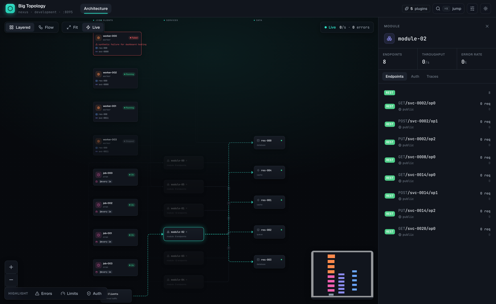
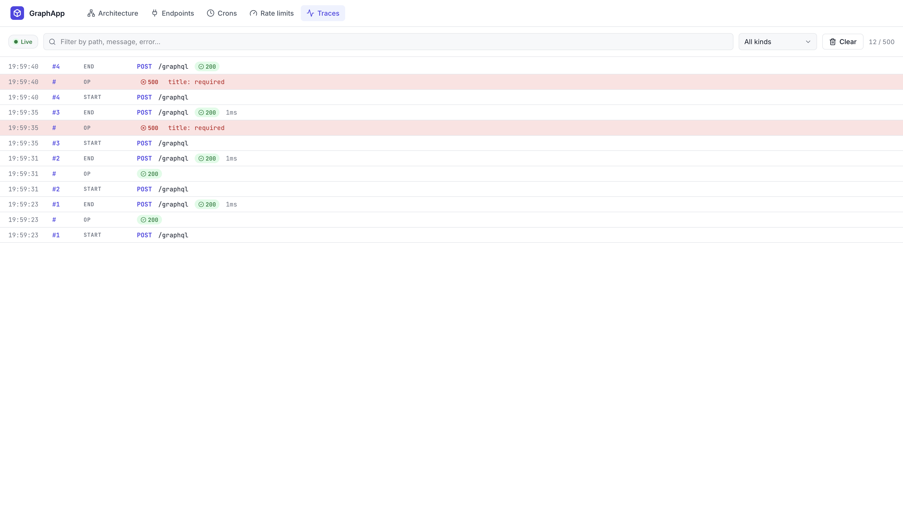

<p align="center">
  
</p>

<h1 align="center">nexus</h1>

<p align="center">
  A Go framework over <a href="https://github.com/gin-gonic/gin">Gin</a> that lets you write plain handlers,
  wires them into REST + GraphQL + WebSocket from one signature, and ships a live dashboard at <code>/__nexus/</code>.
</p>

```go
func main() {
    nexus.Run(
        nexus.Config{
            Server:    nexus.ServerConfig{Addr: ":8080"},
            Dashboard: nexus.DashboardConfig{Enabled: true, Name: "Adverts"},
        },
        nexus.ProvideResources(NewMainDB),
        adverts.Module,
    )
}

var Module = nexus.Module("adverts",
    nexus.Provide(NewService),
    nexus.AsQuery(NewListAdverts),
    nexus.AsMutation(NewCreateAdvert,
        auth.Required(),
        auth.Requires("ROLE_CREATE_ADVERT"),
    ),
)
```



---

## Why nexus

- **One handler, three transports.** `AsRest` / `AsQuery` / `AsMutation` / `AsWS` all read the same reflective signature — `func(svc, deps..., p nexus.Params[Args]) (T, error)` — and wire the right transport.
- **Live architecture view.** `nexus.Module` groups endpoints; constructor introspection draws service → service / service → resource edges automatically. Real traffic pulses on the edges.
- **Built-in auth, rate limits, metrics, traces.** Cross-transport bundles via `nexus.Use`. Per-op observability is free — every handler gets counters + traces with no user code.
- **Typed peer mesh.** `peer.AsCall` exposes a handler to other apps; `peer.Call[T]` calls one. HTTP/2 + JSON over mTLS, persistent multiplexed connections, schema drift detection, trace stitching across binaries. See [Peer mesh](#peer-mesh) below.
- **Configuration server.** Spring-Cloud-Config-style distribution: `config.Server` hosts plaintext yaml (local folder or git); `config.Client` fetches signed snapshots with a sealed cache; `nexus.Get[T]("key", default)` reads typed values from anywhere. WS push for sub-second hot reload. See [Configuration](#configuration) below.
- **Guided tours for any frontend.** `extension/tour` mounts a Shadow-DOM overlay on every HTML response — record click-by-click walkthroughs with auto-screenshots, edit text + reorder + promote substeps from `/__nexus/tour`, play back as numbered-badge highlights. Works on React, Vue, Angular, vanilla — host CSS can't leak in. See [Tours](#tours) below.
- **Node-free frontend.** `nexus add vue` pulls from esm.sh into `~/.nexus/cache`; `nexus build` bundles via esbuild. No `node_modules`, no `npm install`. See [frontend/deps](frontend/deps/README.md).
- **fx under the hood, not in your imports.** `nexus.Run/Module/Provide/Invoke` wrap fx so you get DI + lifecycle without the import.

## Install

```bash
go install github.com/paulmanoni/nexus/cmd/nexus@latest
```

Go 1.25+. For `.vue` source compile support, opt into the QuickJS-backed Vue SFC compiler:

```bash
CGO_ENABLED=1 go install -tags vue github.com/paulmanoni/nexus/cmd/nexus@latest
```

## CLI

```bash
nexus new my-app && cd my-app
nexus dev                 # go run + auto-open the dashboard
```

| Command | What it does |
|---|---|
| `nexus new <dir>` | Scaffold a runnable app (prompts for frontend / db / cache / auth). |
| `nexus init [dir] --frontend=vue\|react` | Scaffold the frontend pipeline (`islands.src/`, embed) into an existing project. |
| `nexus dev [dir]` | `go run` + auto-rebuild frontend on save; opens the dashboard. |
| `nexus build [package]` | Bundle frontend sources under `islands.src/`, then `go build` the main package. |
| `nexus docs [topic]` | Inline reference (`handlers`, `frontend`, `auth`, …). |
| `nexus add <spec>` | Fetch a frontend dep from esm.sh into `~/.nexus/cache`, write `nexus.lock`. |
| `nexus install` | Sync the cache to `nexus.lock` (fresh clones, CI). |
| `nexus remove <spec>` | Drop entry from `nexus.lock`. |
| `nexus update [spec]` | Re-resolve specs, bump `nexus.lock`. |
| `nexus vendor` | Copy cached blobs to `./vendor/nexus/` for air-gapped builds. |
| `nexus gc` | Reclaim cache space from unreferenced blobs. |

## Quick start

```go
// main.go
package main

import "github.com/paulmanoni/nexus"

func main() {
    nexus.Run(
        nexus.Config{
            Server:    nexus.ServerConfig{Addr: ":8080"},
            Dashboard: nexus.DashboardConfig{Enabled: true, Name: "Demo"},
        },
        helloModule,
    )
}

// hello.go
type HelloService struct{}

func NewHelloService() *HelloService { return &HelloService{} }

type SayHelloArgs struct{ Name string }

func (s *HelloService) SayHello(_ context.Context, p nexus.Params[SayHelloArgs]) (string, error) {
    return "Hello, " + p.Input.Name, nil
}

var helloModule = nexus.Module("hello",
    nexus.Provide(NewHelloService),
    nexus.AsQuery((*HelloService).SayHello),
)
```

`nexus dev` runs it, opens the dashboard at `http://localhost:8080/__nexus`, exposes the handler over GraphQL (`{ sayHello(name:"world") }`) and REST (`POST /hello/sayHello`).

## Reflective handlers

One signature, three transports:

```go
// REST: POST /widgets
nexus.AsRest("POST", "/widgets", NewCreateWidget)

// GraphQL: mutation createWidget(input: WidgetInput!): Widget!
nexus.AsMutation(NewCreateWidget)

// GraphQL query: query listWidgets(filter: WidgetFilter): [Widget!]!
nexus.AsQuery(NewListWidgets)

// WebSocket event: emit { type:"chat.send", payload:{...} }
nexus.AsWS("/events", "chat.send", NewChatSend)
```

Each constructor returns a function with the canonical shape:

```go
func NewCreateWidget(svc *WidgetService) func(context.Context, nexus.Params[CreateArgs]) (Widget, error)
```

The framework introspects: `*WidgetService` becomes an fx dependency; `Params[CreateArgs]` declares the input schema; the return type becomes the GraphQL field type. Args + return get auto-mapped to GraphQL input + object types — no schema duplication.

## CRUD generator

```go
type Advert struct {
    ID    uuid.UUID `nexus:"key"`
    Title string
    Body  string
}

var Module = nexus.Module("adverts",
    nexus.ProvideCRUD[Advert]("adverts"),
)
```

Mounts:

```
GET    /adverts          → list
GET    /adverts/:id      → get
POST   /adverts          → create
PUT    /adverts/:id      → update
DELETE /adverts/:id      → delete
```

Plus the corresponding GraphQL queries + mutations. Stores ship for `postgres`, `mysql`, `sqlite`, in-memory; pick via `ProvideStore[Advert](store.Postgres{...})`.

## Cross-transport middleware

```go
nexus.AsMutation(NewCreateAdvert,
    auth.Required(),
    auth.Requires("ROLE_CREATE_ADVERT"),
    ratelimit.PerUser(100, time.Minute),
)
```

Works identically on REST, GraphQL, and WS. Each middleware reads from `nexus.Context` rather than `*gin.Context` so it's transport-agnostic.

## Frontend

Two paths to a bundle the framework can serve:

**1. `nexus add` + `nexus build` (recommended).** Node-free; pulls deps from esm.sh, bundles via esbuild. See [frontend/deps](frontend/deps/README.md).

```bash
nexus add vue @vue-flow/core
nexus build                       # islands.src/*.{ts,tsx,jsx,vue} → islands/
```

**2. Bring your own bundle.** Mount any pre-built SPA from an `embed.FS`:

```go
//go:embed all:web/dist
var webFS embed.FS

nexus.Run(nexus.Config{...},
    nexus.ServeFrontend(webFS, "web/dist"),
    helloModule,
)
```

Unknown paths fall through to `index.html` (SPA-aware). REST/GraphQL/WS/dashboard routes win on conflict.

## Dashboard

Mounted at `/__nexus/` when `Dashboard.Enabled` is true. Shows:

- **Architecture**: services, resources, endpoints, dependency edges. Live updates as registry mutates.
- **Traces**: request waterfalls across services; cross-transport stitched.
- **Crons**: scheduled jobs + last/next-run.
- **Rate limits**: per-key bucket state.



## Listeners, scopes, and TLS

In production you usually want the dashboard surface (`/__nexus/*`) reachable from operators but **not** from the public internet. Nexus does this with named listeners + scopes — one process binds multiple ports, each gated to a subset of routes.

### Scopes

```go
nexus.Config{
    Server: nexus.ServerConfig{
        Listeners: map[string]nexus.Listener{
            "public": {Addr: ":8080",          Scope: nexus.ScopePublic},
            "admin":  {Addr: "127.0.0.1:9090", Scope: nexus.ScopeAdmin},
        },
    },
}
```

- **`ScopePublic`** — user routes (REST / GraphQL / WebSocket) + `/__nexus/health` + `/__nexus/ready`. Dashboard hidden.
- **`ScopeInternal`** — same as public; intended for sidecar / peer traffic.
- **`ScopeAdmin`** — everything: dashboard + user routes (so the in-page testers' relative fetches still work).

Routes outside the listener's scope return `404` — byte-equivalent to "not mounted", so scanners can't fingerprint the dashboard.

### Introspection gate

Belt-and-braces on top of scopes — defaults to **closed** so a misconfigured listener doesn't leak the dashboard:

```go
nexus.Config{
    Introspection:         false,                  // closed in prod (default)
    IntrospectionNetworks: []string{"10.0.0.0/8"}, // VPN bypass
}
```

When closed, every `/__nexus/*` request 404s unless the caller's TCP peer matches an allowlisted CIDR. The gate uses `RemoteIP()`, not `ClientIP()` — `X-Forwarded-For` is spoofable, wrong default for a security gate. Behind an LB, prefer the admin-listener pattern over the CIDR allowlist.

GraphQL field introspection (the `__schema` query) is gated by the same `Introspection` flag — closing the dashboard also closes in-band GraphQL introspection.

### TLS on a listener

Set `Listener.TLS` to terminate HTTPS on that port — the raw TCP listener gets wrapped at bind time:

```go
adminTLS, err := nexus.ServerTLSConfig(
    "admin.crt",     // PEM cert
    "admin.key",     // PEM private key
    "admin-ca.crt",  // optional CA bundle; pass "" to skip mTLS
)
if err != nil { log.Fatal(err) }

nexus.Config{
    Server: nexus.ServerConfig{
        Listeners: map[string]nexus.Listener{
            "public": {Addr: ":8080",         Scope: nexus.ScopePublic},
            "admin":  {Addr: "10.0.0.5:9443", Scope: nexus.ScopeAdmin, TLS: adminTLS},
        },
    },
}
```

When the optional CA file is supplied, the listener requires clients to present a certificate signed by that CA — mTLS, enforced at the TLS layer before any HTTP request is dispatched. Pass `""` for server-only TLS.

`ServerTLSConfig` sets `MinVersion = TLS 1.2` by default. For custom cipher suites or SNI via `GetCertificate`, build a `*tls.Config` directly and assign it to the `TLS` field — anything `crypto/tls` supports works.

> For **public-internet HTTPS with Let's Encrypt auto-issuance**, prefer `extension/tls.Plugin` — it owns its own `:443`/`:80` pair and handles ACME challenges. `Listener.TLS` is the right tool for admin/internal ports fronted by your own cert material (internal CA, mTLS-protected dashboard, etc.).

### Typical production recipe

```go
adminTLS, _ := nexus.ServerTLSConfig("admin.crt", "admin.key", "admin-ca.crt")

nexus.Run(
    nexus.Config{
        Introspection:         false,
        IntrospectionNetworks: []string{"10.0.0.0/8"},
        Server: nexus.ServerConfig{
            Listeners: map[string]nexus.Listener{
                "public": {Addr: ":8080",         Scope: nexus.ScopePublic},
                "admin":  {Addr: "10.0.0.5:9443", Scope: nexus.ScopeAdmin, TLS: adminTLS},
            },
        },
    },
    tls.Plugin(tls.Config{ // public :443 + :80, LE-issued cert for the user-facing port
        Domains: []string{"app.example.com"},
        Email:   "ops@example.com",
    }),
    // ... app modules
)
```

Result: world-facing `:443` serves user traffic over LE-issued HTTPS. Dashboard is reachable only on the private `10.0.0.5:9443` with an mTLS client cert signed by `admin-ca.crt`. `/__nexus/*` is `404` on every other surface even if the network somehow leaks.

## Peer mesh

`extension/peer` ships typed RPC between nexus apps over HTTP/2 + JSON. One persistent multiplexed connection per peer pair, mTLS by default, trace stitching across binaries, and schema-drift detection — explicit, type-safe, no codegen.

### One app, two roles

The same `peer.Module(...)` call wires both sides; pass `Listen` to accept calls, `Peers` to make them, both for the common case:

```go
import "github.com/paulmanoni/nexus/extension/peer"

// orders-svc: exposes createOrder to other apps in the mesh
nexus.Run(nexus.Config{...},
    peer.Module(peer.Config{
        Identity:       "orders-svc",
        Listen:         ":7000",
        TLS:            peer.TLSConfig{Cert: "/etc/orders.crt", Key: "/etc/orders.key", CACert: "/etc/ca.crt"},
        AllowedClients: []string{"checkout-svc"},
    }),
    ordersModule,
)
```

Add `peer.AsCall` next to your existing `AsRest`/`AsQuery` declarations — the handler signature is identical:

```go
var Module = nexus.Module("orders",
    nexus.Provide(NewService),
    nexus.AsRest("POST", "/orders", NewCreateOrderREST), // public HTTP
    peer.AsCall("createOrder", NewCreateOrder),          // peer RPC
)

func NewCreateOrder(svc *Service, p nexus.Params[CreateArgs]) (*Order, error) { ... }
```

### Caller side — typed `Call[T]`

```go
// checkout-svc: calls orders-svc.createOrder
nexus.Run(nexus.Config{...},
    peer.Module(peer.Config{
        Identity: "checkout-svc",
        TLS:      peer.TLSConfig{Cert: "/etc/checkout.crt", Key: "/etc/checkout.key"},
        Peers: map[string]peer.PeerSpec{
            "orders-svc": {URL: "https://orders.internal:7000", CACert: "/etc/ca.crt"},
        },
    }),
    checkoutModule,
)

// In a handler — explicit string method, typed return via generics:
func NewSubmit(svc *Service, peers *peer.Registry, p nexus.Params[Args]) (*Receipt, error) {
    order, err := peer.Call[*Order](p.Context, peers, "orders-svc", "createOrder",
        CreateArgs{UserID: p.Args.UserID})
    if err != nil { return nil, err }
    return &Receipt{OrderID: order.ID}, nil
}
```

The generic parameter is the only place a type appears — Go can't infer it from a string method name. Errors arrive as typed `*peer.Error` you can `errors.As` against; `pe.Code` (`"VALIDATION"`, `"METHOD_UNKNOWN"`, `"SCHEMA_MISSING_REQUIRED"`, …) lets cross-app code branch without rebuilding the error pyramid.

### Built-in safety nets

All on by default; nothing to configure.

| | |
|---|---|
| **Schema drift** | `GET /__peer/schema` emits every method's args/return JSON-Schema. Client lazy-fetches on first call. Hard-fail on missing method or missing required field; pass on forward-compat extras (caller is ahead of peer). |
| **Trace stitching** | `peer.call` (caller) + `peer.handle` (callee) spans share TraceID + parent linkage. Multi-binary traces appear on the dashboard waterfall stitched across processes. |
| **Health prober** | Per-target `GET /__peer/health` every 10s. Failures flip `IsHealthy → false` (multi-target peers stay healthy if at least one replica is up). Schema cache resets on peer-level all-down → caller re-fetches a possibly-rolled-out new schema on recovery. |
| **Concurrency cap** | Per-peer semaphore (default 64) honors `ctx.Done()` so blocked calls abort cleanly on deadline. One slow peer can't drain caller goroutines. |
| **Dashboard tab** | `/__nexus/peers` lists every peer with per-target health, in-flight count, and cached schema state. |

### SRV discovery for replicas

When orders-svc has N replicas behind a service-mesh DNS record:

```go
Peers: map[string]peer.PeerSpec{
    "orders-svc": {
        SRV:    "_nexus._tcp.orders.internal",
        CACert: "/etc/ca.crt",
    },
},
```

Resolves at boot, builds one target per record, round-robins across them, and re-resolves every `SRVRefresh` interval (default 30s). Identity-preserving reconcile means a stable DNS answer is a true no-op — ready state and prober history survive every tick.

### Three auth modes

| Mode | Use | What it pins to |
|---|---|---|
| `AuthMTLS` (default) | Production | Client cert subject against `AllowedClients` via `tls.Config.VerifyConnection` — non-allowlisted peers can't even complete the handshake |
| `AuthHMAC` | Trusted internal networks | Shared secret per peer pair, signed timestamp + body hash; 30s replay window |
| `AuthNone` | Dev only | Refuses to start without `NEXUS_PEER_DEV=1` in env |

### Generating mTLS material — `nexus pki`

Stdlib-only PKI tooling ships with the CLI. ECDSA P-256, 128-bit random serials, no openssl shelling:

```bash
# On the CA host, once:
nexus pki init                                  # → ca.crt + ca.key (0600)

# On each peer (key never travels):
nexus pki request --cn peer-alpha --dns peer-alpha.internal

# On the CA host:
nexus pki sign --csr peer-alpha.csr             # → peer-alpha.crt

# Package for shipping:
nexus pki bundle --cn peer-alpha                # ca.crt + peer-alpha.{crt,key}
```

`nexus pki bundle` is **physically incapable** of including `ca.key` — the bundler never reads or references the CA private key. `grep ca.key cmd/nexus/pki_bundle.go` yields nothing.

For colocated CA + peer (dev / bootstrap), `nexus pki issue --cn name` is the one-shot convenience.

Run `nexus docs peer` or `nexus docs pki` for inline reference.

## Configuration

`extension/config` ships Spring-Cloud-Config-style configuration distribution as a nexus extension. Three entrypoints share one package-level store; handlers read values via `nexus.Get` regardless of where they came from.

### Three entrypoints — pick one per app

| | What it does | Disk state on the client |
|---|---|---|
| `config.Server(source, ...)` | Hosts the source of truth | Plaintext yaml files (operator owns them) |
| `config.Client(url, ...)` | Fetches + verifies + caches | **Sealed** AES-256-GCM, framework-managed key |
| `config.Local(path)` | Single-yaml, no server | **Plaintext** (operator edits with `$EDITOR`) |

### Reading values from handlers

```go
addr := nexus.Get[string]("config.server.addr")              // "" if missing
port := nexus.Get[int]("config.server.port", 8080)           // 8080 default
ttl  := nexus.Get[time.Duration]("config.cache.ttl", 5*time.Minute)

signKey := nexus.MustGet[string]("config.signing.key")       // panics if missing

var pay PaymentConfig
nexus.BindConfig("config.payment", &pay)                     // subtree → struct

nexus.OnConfigChange("config.api.timeout", func(v any) {     // hot-reload
    if d, ok := v.(time.Duration); ok { svc.timeout.Store(d) }
})
```

Resolution priority (highest first):
1. **Environment variable** — `CONFIG_API_TIMEOUT` overrides `config.api.timeout`
2. **Server snapshot** / sealed cache / plaintext local yaml
3. **Default arg** (or `T`'s zero value)

**Type coercion is permissive.** Unquoted yaml ints + bools coerce both directions — `password: 12345` is readable as `Get[string]` ("12345") or `Get[int]` (12345), and a yaml string `port: "5472"` is readable as `Get[int]` (5472). You don't have to defensively quote every value.

**Snapshot installs before `Run()` begins.** `config.Client(...)` and `config.Local(...)` fetch + install the snapshot synchronously, so `Get` works from every `Provide` constructor, `Invoke`, and any code between the option call and `Run`. Connection lifecycle is loud — watch for `config.Client: connecting to … (app=… profile=…)` followed by `config.Client: snapshot installed (… version=…)` in the boot logs.

### The server side

```go
nexus.Run(nexus.Config{...},
    config.Server(config.FromYAML("configs/")),               // local folder
)

// Or backed by git:
config.Server(config.FromGit("git@host:platform/config.git",
    config.GitBranch("main"),
    config.GitSSHKey("/etc/configd/id_ed25519"),
))
```

Layout under the source dir (Spring-compatible, simplified to one file per app):

```
configs/
├── _common.nexus.config.yaml      optional cross-app base
├── app1.nexus.config.yaml
└── app2.nexus.config.yaml
```

Each app's yaml accepts two shapes — pick whichever fits:

```yaml
# Simple — whole body is the default profile, no per-env split
app:
  name: My App
api:
  timeout: 5s
```

```yaml
# Profile-keyed — when you need per-env overrides
app: app1
profiles:
  default: {api: {timeout: "5s"}}
  prod:    {api: {timeout: "30s"}}
```

Resolution = `_common.default → _common.<profile> → <app>.default → <app>.<profile>`, each layer overlaying via deep merge.

**Identity vs Profile.** Two distinct addressing axes — easy to mix up:

| Option | Selects | Example |
|---|---|---|
| `config.Identity("oats")` | **Which file** — the prefix before `.nexus.config.yaml` | `oats.nexus.config.yaml` |
| `config.Profile("default")` | **Which section inside the file** | `profiles.default:`, or the whole body of a flat file |

Flat files (no `profiles:` key) reach as `Profile("default")` automatically. If you get `app "X" not declared`, you typed an Identity that's not a filename in the source dir — the server's error names the available apps.

### The client side — sealed cache, signed snapshots

```go
nexus.Run(nexus.Config{...},
    config.Client("https://configd.internal:7100",
        config.Identity("app1"),
        config.Profile("prod"),
        config.SignerKey("/etc/app1/configd-sign.pub"),
        config.CachePath("/var/lib/app1/config.cache"),
        config.WithClientTLS("/etc/ca.crt", "/etc/app1.crt", "/etc/app1.key"),
        config.OnUnreachable(config.UseCacheOrFail),
    ),
    appModule,
)
```

The cache file is AES-256-GCM sealed; the framework auto-manages the sealing key (sibling `.key` file, `0600`, generated at first boot). Operators never see a key, never see plaintext on the client — the server is the only entity with readable config.

**Dev shortcut.** `nexus dev` sets `NEXUS_CONFIG_DEV=1` on the child env, which makes `SignerKey` and `CachePath` optional and lets the server run with `auth: none`. A SEV1 warning loop fires every 60s while degraded knobs are in use — accidental ship-to-prod is loud, not silent. Bare host URLs work too (`config.Client("localhost:7100", ...)` auto-prepends `http://`).

**Two ports, not one.** `config.Server` binds its own listener (default `:7100`) — _not_ the main app's Gin port. Watch for `config.Server: listening on …` at boot to confirm the right URL. With `auth: none` the server speaks plain HTTP; `auth: hmac` / `auth: mtls` terminate TLS.

### Safety baseline — three mandatory layers

| Layer | Enforced | Defends against |
|---|---|---|
| TLS on the wire | always | eavesdropping, MITM |
| Ed25519 snapshot signatures | always | **a breached config server cannot forge config** — the offline signing key is the integrity floor |
| AES-256-GCM sealed client cache | always (framework-managed key) | disk reads, backup tape leakage, container image inspection |

Plus optional layers — `auth: mtls` (default), `auth: hmac`, or `auth: none` (refuses to start without `NEXUS_CONFIG_DEV=1` + SEV1 warning loop).

### Live refresh — WebSocket push

`config.Client` opens a WS to `/__config/subscribe` at boot. Server-side reloads (file save, future git webhook) fan out to every subscriber; clients re-fetch + verify + apply + re-seal within milliseconds. Polling at `WithPollInterval` (default 30s) stays as the safety net for the WS reconnect window.

### `OnUnreachable` — what happens when the server is down at boot

| Policy | Server up | Server down + valid cache | Server down + no cache |
|---|---|---|---|
| `UseCacheOrFail` (default) | fresh fetch | run on cache | **refuse to boot** |
| `UseCacheAndWarn` | same | same | empty config, SEV1 every 60s |
| `UseDefaults` | same | same | `WithDefaults` map, SEV1 every 60s |

### Local mode — no server

For dev / single-binary deployments:

```go
nexus.Run(nexus.Config{...},
    config.Local("nexus.config.yaml"),
    appModule,
)
```

The yaml stays human-readable + git-friendly. Same `nexus.Get` facade as the server-backed path.

Run `nexus docs config` for the full inline reference.

## Tours

`extension/tour` ships guided walkthroughs for any HTTP-served frontend — React, Vue, Angular, Svelte, vanilla, anything. The plugin captures click-by-click sequences with auto-screenshots, lets operators edit the text in a dashboard, then plays them back as numbered-badge highlights with tooltips on the live UI.

The in-page agent renders inside a **closed Shadow DOM** rooted at `document.body` — host CSS can't bleed in, the plugin's UI can't bleed out, and the host frontend has no idea anything is on top of it.

### Wire it in one line

```go
import "github.com/paulmanoni/nexus/extension/tour"

nexus.Run(nexus.Config{...},
    tour.Module(
        tour.WithGORM(db.DB()),  // production; omit for in-memory
        tour.AutoInject(true),    // splice <script> into every text/html response
    ),
    // ...
)
```

After restart, every HTML page the app serves carries a floating **● Tour** pill (bottom-right). `AutoMigrate` runs on first use to create `nexus_tours` + `nexus_tour_steps`.

### Record / Play / Manage

| Mode | What happens |
|---|---|
| **Record** | Hover any element (blue rectangle follows the mouse), click to capture. Each click takes a screenshot with a numbered badge baked in (via `html2canvas-pro`, lazy-loaded). Clicks _inside_ the previous step's bounding box become **substeps** automatically. **✎ Edit last step** overrides the placeholder title/text/placement inline. |
| **Play** | Fetches tours for the current `pathname`, walks the tree DFS, draws an orange ring + numbered badge on each target with a tooltip beside it. Back / Next / Skip / Done. `scrollIntoView` before measure so off-screen targets are pulled into view. Missing-target path shows the selector + Skip. |
| **Manage** | Visit `/__nexus/tour` for the authoring dashboard — Vue 3 SPA from esm.sh, no framework rebuild. Edit name/route/description; per-step title/text/placement; **↑ ↓** reorder, **→** demote, **←** promote, **×** delete (children reparent). Inline screenshot thumbnails with click-to-zoom. |

### Why "hover on top of any frontend" works

| Property | Why |
|---|---|
| Mounted on `document.body` (outside host root) | Host render cycle can't unmount or rewrite it |
| Closed Shadow DOM | Host CSS — Tailwind reset, Vuetify defaults — can't bleed in; plugin styles can't bleed out |
| `position: fixed; inset: 0; z-index: 2147483647` | Always on top, even above modal libraries using `z-index: 9999` |
| `pointer-events: none` on root, `auto` on interactive UI | Host clicks pass through where the plugin isn't actively presenting |
| Vanilla JS agent (no Vue/React runtime) | Zero conflicts with the host's framework |
| MutationObserver re-attaches if removed | SPA route swaps, Vue Teleports, Vuetify portals, and `body.innerHTML = …` won't kill the overlay — it self-restores in the next tick |

### Drive it from the host

The agent exposes `window.nexusTour = { record, play, stop }` so a host's own "Help" button can trigger a tour without using the pill:

```js
<button onClick={() => window.nexusTour.play()}>Show me how</button>
```

Run `nexus docs tour` for the full inline reference (when added) or browse `extension/tour/agent/inject.js` — the entire client runtime is one self-contained file.

## Examples

The framework ships a few self-contained examples under `examples/`:

| | |
|---|---|
| `petstore` | REST + GraphQL CRUD; the canonical "small app" |
| `petstore-spa` | Same with a frontend bundle served from `embed.FS` |
| `pubsub` | Redis + RabbitMQ adapters |
| `wsecho`, `wstest` | WebSocket patterns |
| `graphapp` | GraphQL-first app with cross-resolver auth |
| `fxapp` | Direct fx wiring without the nexus.Run wrapper |

## Layout

```
.                          framework root + public API surface
├── cmd/nexus/             CLI binary
├── frontend/deps/         node-free dep manager + bundler (see its README)
├── extension/             optional integrations (auth, oauth2, ratelimit,
│                          metrics, cron, dashboard, frontend, peer,
│                          config, tls, …)
├── graph/                 GraphQL builder + resolver introspection
├── transport/             gin/REST + WS adapters
├── manifest/              app self-description JSON (served at /__nexus/manifest)
├── registry/              endpoint + service + resource graph
└── examples/              self-contained sample apps
```

## License

MIT.
