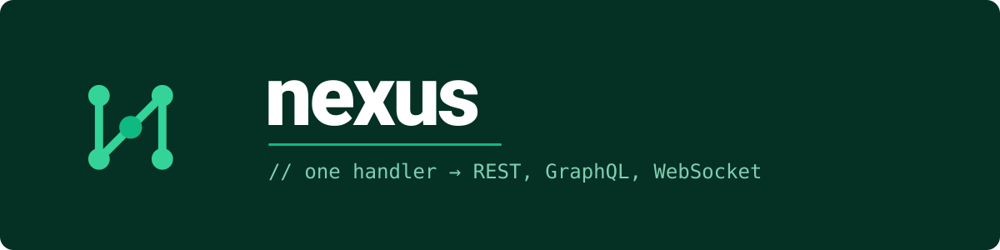

<p align="center">
  <picture>
    <source media="(prefers-color-scheme: dark)" srcset="docs/banner.svg">
    <source media="(prefers-color-scheme: light)" srcset="docs/banner-light.svg">
    
  </picture>
</p>

<p align="center">
  Write a plain Go function. Get REST + GraphQL + WebSocket from it — plus a live dashboard.
</p>

<p align="center">
  <a href="https://github.com/paulmanoni/nexus/releases/latest"></a>
  <a href="https://pkg.go.dev/github.com/paulmanoni/nexus"></a>
  <a href="go.mod"></a>
  <a href="https://deps.dev/go/github.com%2Fpaulmanoni%2Fnexus"></a>
  <a href="#license"></a>
</p>

<p align="center">
  <a href="#install">Install</a> &#183;
  <a href="#60-second-start">60-second start</a> &#183;
  <a href="#write-your-first-handler">First handler</a> &#183;
  <a href="#the-dashboard">Dashboard</a> &#183;
  <a href="#going-further">Going further</a>
</p>

---

**nexus** is a Go framework. You write one plain function; nexus exposes it over
**REST, GraphQL, and WebSocket** from the same signature, wires up dependencies for
you, and ships a live **dashboard** at `/__nexus/` that draws your whole app and shows
traffic in real time. No code generation, no schema files, and **no Node.js** for the
frontend. The HTTP router is pluggable behind a small seam — the default backend is the
standard library (`net/http`, zero third-party router deps); [chi](https://github.com/go-chi/chi)
and [Gin](https://github.com/gin-gonic/gin) are opt-in via `nexus.WithRouter(...)` (the Gin
adapter is a separate module, so gin never enters a default build's dependency graph).

## Install

```bash
go install github.com/paulmanoni/nexus/cmd/nexus@latest
```

Needs Go 1.26+. That's it — pure Go, no C toolchain, no npm.

## 60-second start

```bash
nexus new my-app      # scaffold a runnable app (answer a few prompts, or add --yes)
cd my-app
nexus dev             # run it with live reload + dashboard
```

Open **http://localhost:8080/__nexus** to see the dashboard. Your API is live too — try
the GraphQL IDE at **http://localhost:8080/graphql**.

## Write your first handler

Create `main.go`:

```go
package main

import (
    "context"

    "github.com/paulmanoni/nexus"
)

// 1. A service — just a struct with a constructor.
type Greeter struct{}

func NewGreeter() *Greeter { return &Greeter{} }

// 2. A handler — a normal method. p.Args holds your typed input.
type HelloArgs struct{ Name string }

func (g *Greeter) SayHello(_ context.Context, p nexus.Params[HelloArgs]) (string, error) {
    return "Hello, " + p.Args.Name + "!", nil
}

// 3. Wire it up.
func main() {
    nexus.Run(
        nexus.Config{
            Server:        nexus.ServerConfig{Addr: ":8080"},
            Dashboard:     nexus.DashboardConfig{Enabled: true, Name: "Demo"},
            Introspection: true, // open /__nexus (nexus dev sets this for you)
        },
        nexus.Module("hello",
            nexus.Provide(NewGreeter),
            nexus.AsQuery((*Greeter).SayHello),                  // GraphQL
            nexus.AsRest("POST", "/hello", (*Greeter).SayHello), // REST
        ),
    )
}
```

Run it with `go run .` (or `nexus dev`), then call it any way you like:

```bash
# GraphQL
curl localhost:8080/graphql -d '{"query":"{ sayHello(name:\"world\") }"}'

# REST
curl localhost:8080/hello -d '{"name":"world"}'
```

Same function, three transports. Add `nexus.AsMutation(...)` for a GraphQL mutation or
`nexus.AsWS(...)` for a WebSocket event — all read the same signature.

## The dashboard

Visit `/__nexus/` (enabled above) and you get a live map of your app, built automatically
from what you registered — no setup:


- **See everything** — every module, endpoint, resource, worker, and cron, with the
  dependency edges between them. Real traffic pulses on the wires.
- **Click any node** — the Inspector shows its endpoints, auth rules, recent traces, crons,
  and rate limits, with a built-in tester to fire requests.
- **It's live** — updates stream over a WebSocket, so it's always current and costs your
  API nothing per request.

> The dashboard is **off by default in production** (every `/__nexus/*` path 404s) — turn it
> on with `Dashboard.Enabled` + `Introspection: true`. `nexus dev` turns it on for you.

## A little more

Add cross-transport middleware right where you register a handler — it works the same on
REST, GraphQL, and WS:

```go
nexus.AsMutation(NewCreateOrder,
    auth.Required(),                 // 401 if not logged in
    auth.Requires("ROLE_ADMIN"),     // 403 if missing the role
    ratelimit.PerUser(100, time.Minute),
)
```

Generate a full CRUD API (REST + GraphQL) from a struct:

```go
type Todo struct {
    ID    uuid.UUID `nexus:"key"`
    Title string
    Done  bool
}

nexus.Module("todos", nexus.ProvideCRUD[Todo]("todos"))
// → GET/POST /todos, GET/PUT/DELETE /todos/:id, plus GraphQL queries + mutations
```

Add a frontend with **no Node.js required** — nexus ships an embedded "Vite for Go":

```bash
nexus new my-app --frontend vue   # or react
nexus dev                         # SPA with hot-reload on :5173, API on :8080
```

## Client SDK

Flip one switch and nexus generates **and** serves a typed JS/TS client for all three
transports — no npm package, no codegen step to run:

```toml
[runtime]
sdk = true
```

Then, in your frontend:

```ts
import { NexusClient } from 'nexus-client'

const nx = new NexusClient()

await nx.rest('GET', '/pets/:id', { id })   // REST
await nx.query('searchPets', { q: 'cat' })  // GraphQL
await nx.auth.login({ username, password }) // auth flow
nx.ws('/events').on('chat.message', render) // WebSocket
```

Vue composables (`useQuery`, `useMutation`, `useAuth`, …) and React hooks ship alongside.
`sdk = true` activates only under `nexus dev` or when `introspection = true`, so a
locked-down production binary never exposes the API surface from this flag alone.

**Secure by default.** Tokens live in memory (cleared on reload) so an XSS can't lift a
long-lived credential — opt into `localStorage` explicitly when you want persistence.
Cookie-based auth gets automatic CSRF double-submit, and the SDK routes
(`/__nexus/client/*`) sit behind the same introspection gate as the dashboard.

Tune the auth wiring from `auth.Config` — where the login token lives and the CSRF pair
(values shown are the defaults):

```go
auth.Module(auth.Config{
    // ... schemes ...
    LoginTokenField: "data.token",  // dotted path to the token in a login response
    CSRFCookie:      "csrftoken",   // Django/Laravel convention
    CSRFHeader:      "X-CSRFToken",
})
```

For production, vendor the SDK at build time instead of serving it at runtime:
`nexus client --out ./web/sdk`.

## Going further

When you're ready for more, each area has its own focused guide:

| Topic | Where |
|---|---|
| Every feature, inline | `nexus docs` (e.g. `nexus docs handlers`, `nexus docs dashboard`) |
| Auth & OAuth2 server | `extension/auth`, `extension/oauth2` |
| Production: ports, scopes, TLS, mTLS | hide the dashboard from the internet with named listeners + the introspection gate |
| Typed RPC between apps (peer mesh) | [extension/peer/README.md](extension/peer/README.md) |
| Config server + `nexus.toml` | [extension/config/README.md](extension/config/README.md) |
| Guided product tours (PDF/Word export) | [extension/tour/README.md](extension/tour/README.md) |
| Runnable sample apps | the [`examples/`](examples) folder (`petstore`, `petstore-spa`, `pubsub`, `wsecho`, `graphapp`, `bigtopo`) |

A couple of handy extras:

- **`nexus.HideFromDashboard()`** — drop an internal endpoint from the dashboard while it keeps serving.

## License

MIT.
